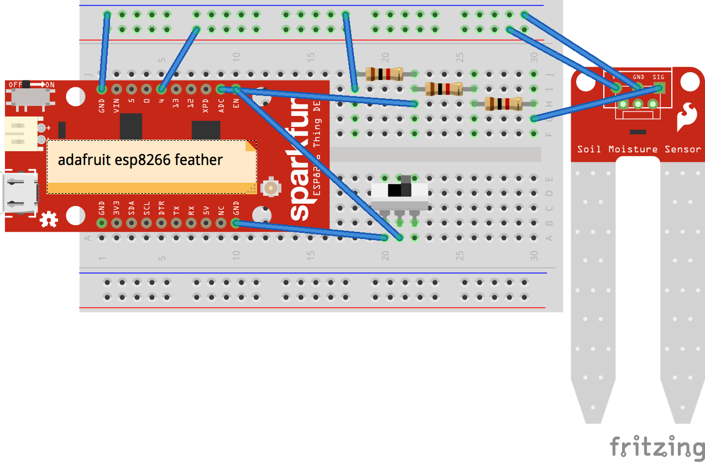
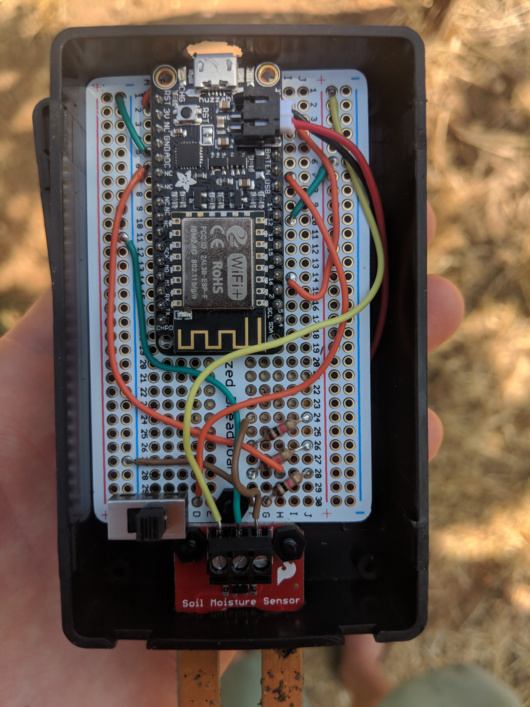

## AWS-IOT ESP8266 device

### Getting Started

#### Register a thing with AWS iot
https://aws.amazon.com/iot-core/

#### Download and convert cert and private key
###### Convert PEM to DER format: (On Windowns you should download openssl first)
`$ openssl x509 -in aaaaaaaaa-certificate.pem.crt.txt -out cert.der -outform DER`

`$ openssl rsa -in aaaaaaaaaa-private.pem.key -out private.der -outform DER`
###### Convert to binary
`$ xxd -i <cert/key file in DER format>`

#### Create a `secrets.h` file
```c
#define BIN_CRT <binary certificate>
#define BIN_CRT_LEN <binary cert length>
#define BIN_KEY <binary private key>
#define BIN_KEY_LEN <binary key length>
#define AWS_ENDPOINT <"foobar.iot.region.amazonaws.com">
#define UPDATE_TOPIC <"$aws/things/yourThingName/shadow/update">
```

#### Upload the code with Arduino IDE

#### Connect to the AP
- Look for the wifi with an SSID like `ESP-<some id>`
- Visit 192.168.4.1 in your browser
- Input wifi credentials that the device can connect to

#### See it update the device shadow
The device will update the shadow, then deep sleep for 10 seconds.

#### BOM
- [Adafruit Huzzah ESP8266](https://www.adafruit.com/product/2821)
- [Sparkfun Soil Moisture Sensor](https://www.sparkfun.com/products/13322)





